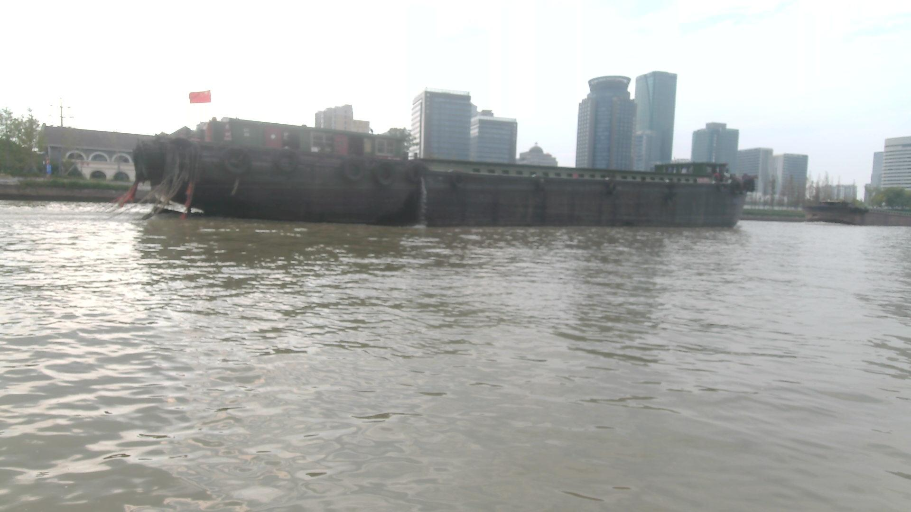
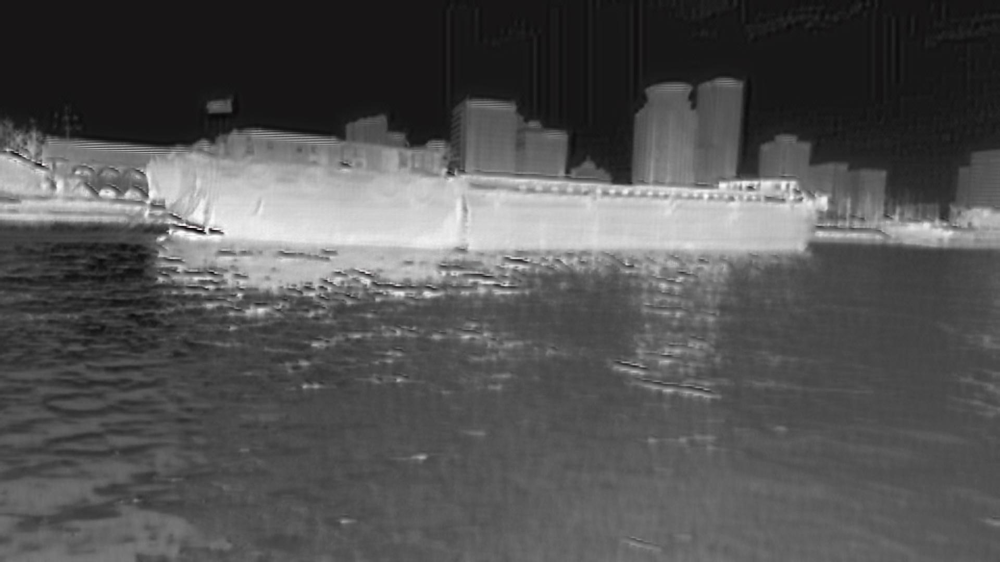
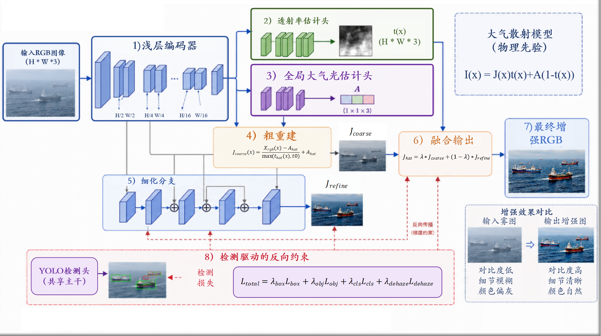
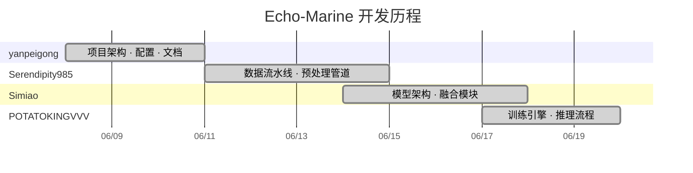

<div align="center">


<br>
<br>


<br>


</div>

<br>

<h3 align="center"><em>C3 智能感知 · 三模态融合目标检测</em></h3>

<p align="center">
面向 <strong>全国海洋航行器设计与制作大赛</strong> C3 智能感知赛题 — 复杂海况下浮标等多类目标的鲁棒实时检测<br>
基于 YOLO 架构融合 <strong>RGB 可见光 · 红外热成像 · 雷达点迹</strong>，通过 <strong>QG-CMF</strong> 感知门控模块自适应整合多源异构特征
</p>

---

## 目录

- [方案亮点](#-方案亮点)
- [架构总览](#-架构总览)
- [项目结构](#-项目结构)
- [快速开始](#-快速开始)
- [数据集](#-数据集)
- [运行流程](#-运行流程)
- [配置说明](#-配置说明)
- [开发团队](#-开发团队)
- [文档](#-文档)

---

## 方案亮点

<div align="center">

<table>
<tr>
<td width="33%" align="center" valign="top">

### 三模态融合

RGB 可见光 — 轻量去雾增强<br>
IR 红外 — 弱光与夜间轮廓补充<br>
Radar 雷达 — 点迹投影为多通道特征图

</td>
<td width="33%" align="center" valign="top">

### QG-CMF 融合

质量感知门控交叉模态融合<br>
自适应抑制失效模态<br>
动态加权多源特征

</td>
<td width="34%" align="center" valign="top">

### 实时推理

YOLO 风格 FPN/PAN 多尺度检测头<br>
混合精度训练 + EMA + Cosine 退火<br>
训练 / 验证 / 推理一体化流水线

</td>
</tr>
</table>

</div>

<div align="center">

**Visible &nbsp;·&nbsp; Infrared** &nbsp;—&nbsp; *同一场景，多光谱互补*

<br>


&nbsp;


<sub>左：可见光（纹理色彩丰富）&nbsp;&nbsp;|&nbsp;&nbsp;右：红外热成像（目标热辐射突出）</sub>

</div>

---

## 架构总览

三路输入（RGB / IR / Radar）经各自骨干分支提取特征后，由 QG-CMF 质量感知门控融合模块动态整合，再通过 FPN/PAN 多尺度颈部送入 YOLO 检测头输出检测结果。

<div align="center">



</div>

---

## 项目结构

```
Echo-Marine/
├── assets/
│   ├── logo.png                    # 项目 Logo 横幅
│   ├── architecture.png            # 模型架构图
│   ├── before.jpg                  # RGB 可见光示例
│   └── after.png                   # 红外热成像示例
├── configs/
│   └── c3_multimodal_yolo.yaml    # 训练 / 模型 / 数据 统一配置
├── src/
│   ├── data/                       # 数据流水线
│   │   ├── dataset.py              # 多模态 Dataset
│   │   ├── augment.py              # HSV / 翻转增强
│   │   ├── build.py                # DataLoader 构建
│   │   └── radar.py                # 雷达点迹 → 图像投影
│   ├── models/                     # 模型架构
│   │   ├── backbone.py             # 多分支骨干网络
│   │   ├── dehaze.py               # 去雾增强模块
│   │   ├── fusion.py               # QG-CMF 融合模块
│   │   ├── head.py                 # YOLO 检测头
│   │   ├── common.py               # 通用组件
│   │   └── multimodal_yolo.py      # 主模型入口
│   ├── engine/                     # 训练推理引擎
│   │   ├── trainer.py              # 训练循环
│   │   ├── losses.py               # 损失函数 (CIoU + Focal)
│   │   ├── matcher.py              # 标签匹配
│   │   ├── metrics.py              # mAP / Recall
│   │   ├── inference.py            # 推理流程
│   │   ├── decode.py               # 检测解码
│   │   ├── postprocess.py          # NMS 后处理
│   │   └── boxes.py                # 边界框操作
│   └── utils/                      # 工具库
│       ├── config.py               # 配置解析
│       ├── logger.py               # 日志记录
│       └── misc.py                 # 辅助函数
├── tools/
│   └── train_server.py             # 训练服务脚本
├── train.py                        # 训练入口
├── infer.py                        # 推理入口
├── requirements.txt                # 依赖清单
└── README.md
```

---

## 快速开始

### 环境搭建

```bash
# 1. 克隆仓库
git clone https://github.com/yanpeigong/Echo-Marine.git
cd Echo-Marine
```

```bash
# 2. 创建并激活 conda 环境 (Python ≥ 3.10)
conda create -n echo-marine python=3.10 -y
conda activate echo-marine
```

```bash
# 3. 安装依赖
pip install -r requirements.txt
```

> 依赖清单：**Python ≥ 3.10** · **PyTorch ≥ 2.2** · **CUDA ≥ 11.8 (推荐 12.1)** · **OpenCV ≥ 4.8**

---

## 数据集

### 数据结构

```
processed/c3_bbox_dataset/
├── train/
│   ├── rgb/          # 可见光图像
│   ├── ir/           # 红外热成像
│   ├── radar/        # 雷达点迹投影图
│   └── labels/       # YOLO txt 标注
├── val/
├── test/
├── dataset_meta.json
└── dataset.yaml
```

### 检测类别

| ID | 类别 | 英文 |
|----|------|------|
| 0 | 浮标 | buoy |
| 1 | 舰船 | ship |
| 2 | 小艇 | boat |
| 3 | 货轮 | vessel |
| 4 | 皮划艇 | kayak |

> 每个样本由 `rgb / ir / radar / labels` 四部分组成，文件名一一对应，标签格式为 **YOLO txt**。

---

## 运行流程

### 训练

```bash
python train.py --config configs/c3_multimodal_yolo.yaml
```

### 验证

```bash
python train.py \
  --config configs/c3_multimodal_yolo.yaml \
  --evaluate-only \
  --checkpoint runs/c3_multimodal_yolo/best.pt
```

### 推理

```bash
python infer.py \
  --config configs/c3_multimodal_yolo.yaml \
  --checkpoint runs/c3_multimodal_yolo/best.pt \
  --split test \
  --save-dir runs/c3_multimodal_yolo/infer_test
```

---

## 配置说明

<details>
<summary>点击展开关键配置项</summary>

| 配置项 | 默认值 | 说明 |
|--------|--------|------|
| `model.width_mult` | 1.0 | 模型宽度缩放 |
| `model.dehaze.enabled` | true | 去雾增强开关 |
| `model.fusion.hidden_dim` | 256 | 融合模块隐层维度 |
| `train.epochs` | 120 | 训练轮数 |
| `train.batch_size` | 8 | 批次大小 |
| `train.mixed_precision` | true | 混合精度训练 |
| `optimizer.lr` | 0.0002 | 初始学习率 |
| `optimizer.type` | adamw | 优化器类型 |
| `scheduler.type` | cosine | 学习率策略 |
| `loss.box_weight` | 5.0 | 边界框损失权重 |
| `inference.conf_threshold` | 0.25 | 置信度阈值 |

</details>

---

## 开发团队

<table>
<tr align="center">
  <td><strong>yanpeigong</strong></td>
  <td><strong>Serendipity985</strong></td>
  <td><strong>Simiao</strong></td>
  <td><strong>POTATOKINGVVV</strong></td>
</tr>
<tr align="center">
  <td>项目架构</td>
  <td>数据流水线</td>
  <td>模型架构</td>
  <td>训练引擎</td>
</tr>
<tr align="center">
  <td><sub>配置 · 文档 · 规范</sub></td>
  <td><sub>Dataset · Augment · Radar</sub></td>
  <td><sub>Backbone · Fusion · Head</sub></td>
  <td><sub>Trainer · Loss · Inference</sub></td>
</tr>
</table>

### 开发时间线



---

## 文档

- 完整比赛报告 → [`docs/C3_智能感知_算法方案报告.md`](docs/C3_智能感知_算法方案报告.md)
- 超参配置模板 → [`configs/c3_multimodal_yolo.yaml`](configs/c3_multimodal_yolo.yaml)

---

<p align="center">
  <sub>Built for 全国海洋航行器设计与制作大赛 · C3 智能感知赛题</sub>
</p>
